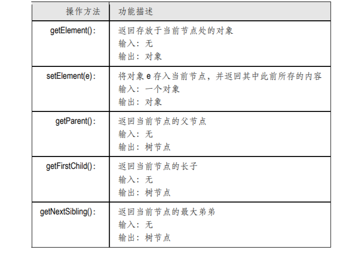
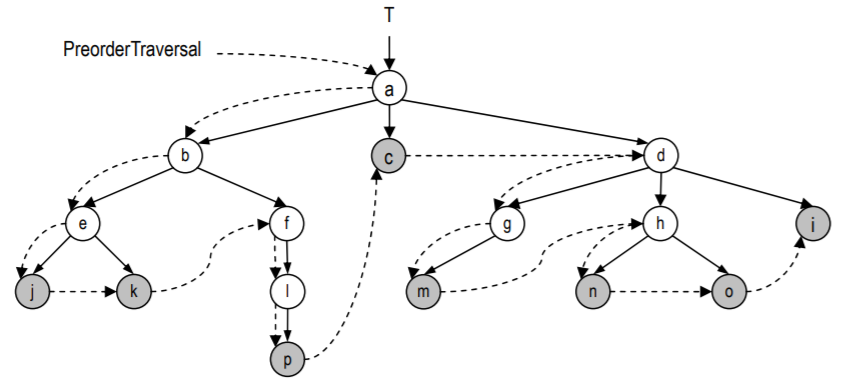
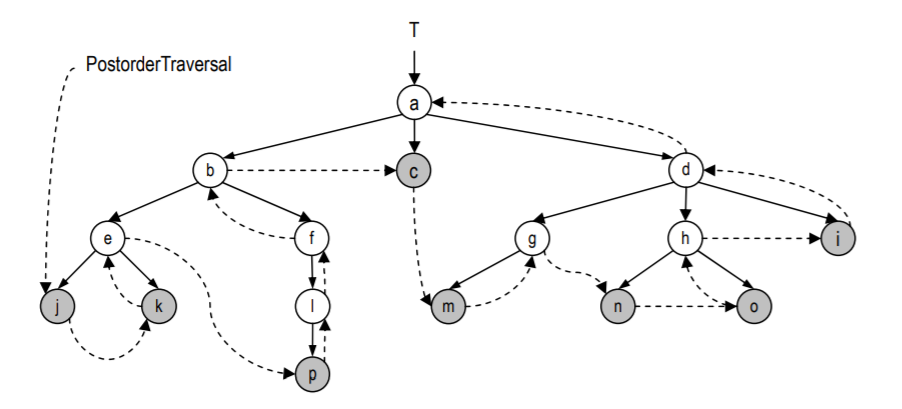
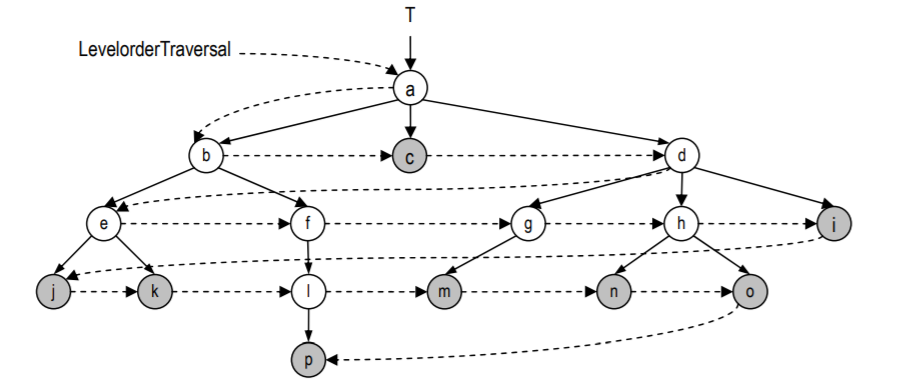
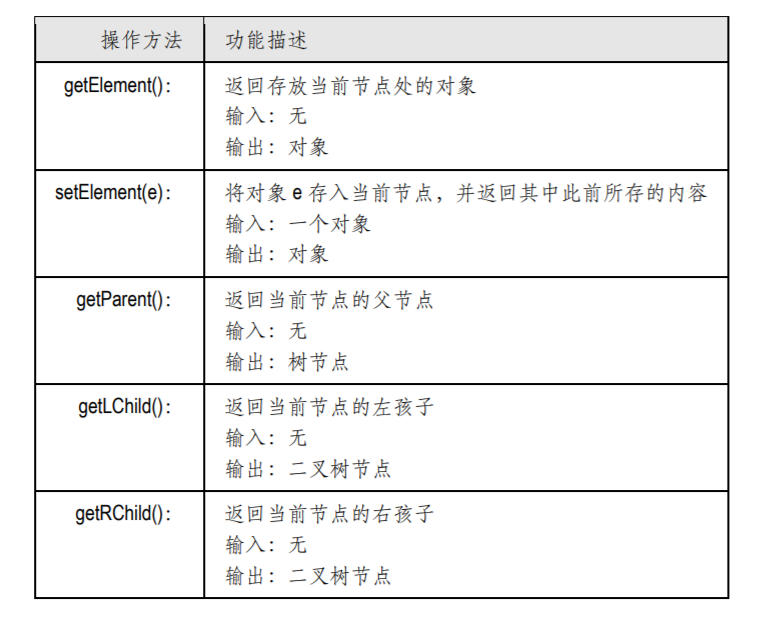

## 数据结构 ☞ 树

- [术语及性质](#术语及性质)
- [树ADT](#树ADT)
- [树的Java接口](#树的Java接口)
- [基于链表实现树](#基于链表实现树)
- [树的遍历](#树的遍历)
    - [前序后序遍历](#前序后序遍历)
    - [层次遍历](#层次遍历)
    - [树迭代器](#树迭代器)
- [二叉树抽象数据类型及其实现](#二叉树抽象数据类型及其实现)
    - [二叉树类的Java接口](#二叉树类的Java接口)
    - [BinTreePosition接口](#BinTreePosition接口)

### 术语及性质

尽管树不是线性结构，但是得益于其层次化的特点，我们还是可以说“树的某一元素是另一元
素‘直接上邻’”，也可以说“某一元素是另一元素的‘直接下邻’之一”。这些关系可以形象地用“父亲”、
“孩子”、“祖先”和“后代”等术语来描述，下面我们首先对此做一介绍。

### 树ADT 
树抽象类型要支持以下的基本方法：



不同的应用问题会要求树结构提供不同方法。这方面的差异太大，我
们无法在树 ADT 中定义出通用的更新操作。在后续章节的讨论中，我们将结合各种应用问题，陆续
给出一些具体的更新操作的实现。

###  树的Java接口
[原始代码所在目录请点击这里](../../../../../source-code/src/main/java/com/javayh/advanced/java/datastructure/tree)
```java
public interface Tree<E>
{
    /**
     * 返回当前节点存放的对象
     * @return
     */
    E getElem();

    /**
     * 将element 存放到当前节点，并返回此前对象
     * @param element
     * @return
     */
    E setElem(E element);

    /**
     * 返回当前节点的父节点
     * @return
     */
    TreeLinkedList<E> getParent();

    /**
     * 返回当前节点的长子
     * @return
     */
    TreeLinkedList<E> getFirstChild();

    /**
     * 返回当前节点的最大弟弟
     * @return
     */
    TreeLinkedList<E> getNextSibling();

    /**
     * 返回当前节点后代元素的数目，即以当前节点为根的子树的规模
     * @return
     */
    int size();

    /**
     * 返回当前节点的高度
     * @return
     */
    int getHeight();

    /**
     * 返回当前节点的深度
     * @return
     */
    int getDepth();
}
```

### 基于链表实现树

```java
public class TreeLinkedList<E> implements Tree<E> {

    /**根节点*/
    private E element;

    /**父亲、长子及最大的弟弟*/
    private TreeLinkedList<E> parent, firstChild, nextSibling;

    public TreeLinkedList() {
        this(null,null,null,null);
    }

    public TreeLinkedList(E element, TreeLinkedList<E> parent, TreeLinkedList<E> firstChild, TreeLinkedList<E> nextSibling) {
        this.element = element;
        this.parent = parent;
        this.firstChild = firstChild;
        this.nextSibling = nextSibling;
    }

    @Override
    public E getElem() {
        return element;
    }

    @Override
    public E setElem(E element) {
        E old = this.element;
        this.element = element;
        return old;
    }

    @Override
    public TreeLinkedList<E> getParent() {
        return this.parent;
    }

    @Override
    public TreeLinkedList<E> getFirstChild() {
        return this.firstChild;
    }

    /**
     * <p>
     *     返回当前节点的最大弟弟；若没有弟弟，则返回null
     * </p>
     * @return com.javayh.advanced.java.datastructure.tree.linked.TreeLinkedList<E>
     */
    @Override
    public TreeLinkedList<E> getNextSibling() {
        return this.nextSibling;
    }

    /**
     * 首先通过 firstChild 引用找出根节点的长子，并沿着 nextSibling 引用顺
     * 次找到其余的孩子，递归地统计出各子树的规模。最后，只要将所有子树的规模累加起来，再计入
     * 根节点本身，就得到了整棵树的规模。当遇到没有任何孩子的节点（即原树的叶子）时，递归终止。
     * 如果不计入递归调用，该算法在每个节点上只需花费常数时间，因此若树的规模为 n，则总的
     * 时间复杂度为 O(n)。读者也许注意到了，实际上，这一算法也能够在 O(n)时间内统计出树中所有子
     * 树的规模
     */
    @Override
    public int size() {
        //当前节点也是自己的后代
        int size = 1;
        //从长子开始
        TreeLinkedList<E> subtree = firstChild;
        while (null != subtree)
        {   // 累加
            size += subtree.size();
            // 所有孩子的后代数目
            subtree = subtree.getNextSibling();
        }//即可得到当前节点的后代总数
        return size;
    }

    /**
     * 法 getHeight(v)也是首先通过 firstChild 引用找出根节点的长子，并沿着 nextSibling
     * 引用顺次找到其余的孩子，递归地计算出各子树的高度。最后，只要找出所有子树的最大高度，再
     * 计入根节点本身，就得到了根节点的高度（即树高）
     */
    @Override
    public int getHeight() {
        int height = -1;
        //从长子开始
        TreeLinkedList<E> subtree = firstChild;
        while (null != subtree){
            //在所有孩子中取最大的高度
            height = Math.max(height,subtree.getHeight());
            subtree = subtree.getNextSibling();
        }
        return height+1;
    }

    @Override
    public int getDepth() {
        int depth = 0;
        //从父亲开始
        TreeLinkedList<E> p = parent;
        while (null != p) {
            depth++;
            //访问各个真祖先
            p = p.getParent();
        }//真祖先的数目，即为当前节点的深度
        return depth;
    }
}
```

### 树的遍历
#### 前序后序遍历

所谓树的遍历（Traversal），就是按照某种次序访问树中的节点，且每个节点恰好访问一次。
也就是说，按照被访问的次序，可以得到由树中所有节点排成的一个序列。

我们将分别介绍两种最基本的树遍历算法⎯⎯前序遍历（Preoder trave rsal）和后
序遍历（Postorder traver sal）。这两种遍历算法都是递归定义的，只是其中对“次序”的定义略有不同。

对任一（子）树的前序遍历，将首先访问其根节点，然后再递归地对其下的各棵子树进行前序
遍历。对于同一根节点下的各棵子树，遍历的次序通常是任意的；但若换成有序树，则可以按照兄
弟间相应的次序对它们实施遍历。由前序遍历生成的节点序列，称作前序遍历序列。

- 前序遍历的过程可以描述为 

```java
算法：PreorderTraversal(v)
输入：树节点v
输出：v所有后代的前序遍历序列
{
 if (null != v) {
 首先访问并输出v;
 for (u = v.getFirstChild(); null != u; u = u.getNextSibling()) //依次
 PreorderTraversal(u);//前序遍历v的各棵子树
 }
} 
```


对称地，对任一（子）树的后序遍历将首先递归地对根节点下的各棵子树进行后序遍历，最后
才访问根节点。由后序遍历生成的节点序列，称作后序遍历序列。

- 后序遍历过程可以描述为 

```java
算法：PostorderTraversal(v)
输入：树节点v
输出：v所有后代的后序遍历序列
{
 if (null != v) {
 for (u = v.getFirstChild(); null != u; u = u.getNextSibling()) //依次
 PostorderTraversal(u);//后序遍历v的各棵子树
 当所有后代都访问过后，最后才访问并输出节点v;
 }
} 
```


#### 层次遍历

除了上述两种最常见的遍历算法，还有其它一些遍历算法，层次遍历（Traversal by level ）算
法就是其中的一种。在这种遍历中，各节点被访问的次序取决于它们各自的深度，其策略可以总结
为“深度小的节点优先访问”。对于同一深度的节点，访问的次序可以是随机的，通常取决于它们的
存储次序，即首先访问由firstChild指定的长子，然后根据nextSibling确定后续节点的次序。当然，
若是有序树（定义四.13，第 106 页），则同深度节点的访问次序将与有序树确定的次序一致。

层次遍历过程可以借助一个队列来实现：

```java
算法：LevelorderTraversal(v)
输入：树节点v
输出：v所有后代的层次遍历序列
{
 if (null != v) {
 创建一个队列Q;
 Q.enqueue(v);//根节点入队
 while (!Q.isEmpty()) {//在队列重新变空之前
 u = Q.dequeue();//取出队列的首节点u
 访问并输出u;
 for (w = u.getFirstChild(); null != w; w = w.nextSibling())//依次将u的
 Q.enqueue(w);//每个孩子w加至队列中
 } //while
 } //if
} 
```



#### 树迭代器
```java
public class IteratorTree<E> implements Iterator<E> {
    private List list;//列表
    private Position nextPosition;//当前（下一个）元素的位置
    //默认构造方法
    public IteratorTree() { list = null; }
    //前序遍历
    public void elementsPreorderIterator(TreeLinkedList T) {
        if (null == T) {return;}//递归基
        list.insertLast(T);//首先输出当前节点
        TreeLinkedList subtree = T.getFirstChild();//从当前节点的长子开始
        while (null != subtree) {//依次对当前节点的各个孩子
            this.elementsPreorderIterator(subtree);//做前序遍历
            subtree = subtree.getNextSibling();
        }
    }
    //后序遍历
    public void elementsPostorderIterator(TreeLinkedList T) {
        if (null == T) return;//递归基
        TreeLinkedList subtree = T.getFirstChild();//从当前节点的长子开始
        while (null != subtree) {//依次对当前节点的各个孩子
            this.elementsPostorderIterator(subtree);//做后序遍历
            subtree = subtree.getNextSibling();
        }
        list.insertLast(T);//当所有后代都访问过后，最后才访问当前节点
    }
    //层次遍历
    @SneakyThrows
    public void levelTraversalIterator(TreeLinkedList T) {
        if (null == T) return;
        QueueArray Q = new QueueArray();//空队
        Q.enqueue(T);//根节点入队
        while (!Q.isEmpty()) {//在队列重新变空之前
            TreeLinkedList tree = (TreeLinkedList) (Q.dequeue());//取出队列首节点
            list.insertLast(tree);//将新出队的节点接入迭代器中
            TreeLinkedList subtree = tree.getFirstChild();//从tree的第一个孩子起
            while (null != subtree) {//依次找出所有孩子，并
                Q.enqueue(subtree);//将其加至队列中
                subtree = subtree.getNextSibling();
            }
        }
    }

    //检查迭代器中是否还有剩余的元素
    @Override
    public boolean hasNext() {
        return (null != nextPosition);
    }

    //返回迭代器中的下一元素
    @SneakyThrows
    @Override
    public E next() {
        if (!hasNext()) {
            throw new ExceptionNoSuchElement("No next position");
        }
        Position currentPosition = nextPosition;
        if (currentPosition == list.last()) {//若已到达尾元素，则
            nextPosition = null;//不再有下一元素
        }
        else {//否则
            nextPosition = list.getNext(currentPosition);//转向下一元素
        }
        return (E) currentPosition.getElem();
    }
}
```

### 二叉树抽象数据类型及其实现

在算法领域，二叉树的重要地位是其它结构无法替代的。每个节点均不超过 2 度的有序树，称作二叉树（Binary tree），
因此每个节点的孩子（如果存在的话）可以左、右区分，分别称作左孩子和右孩子⎯⎯之所以如此命名，
是因为在画出二叉树时，通常都将左、右孩子分别画在其父节点的左下方、右下方。

在几乎所有的应用问题中，都可以看到二叉树的身影。而且令我们感到惊讶的是，尽管二叉树
只是树的一种特例，但无论是从对应用问题的描述与刻画能力，还是从计算能力的角度来看，二叉
树并不逊色于一般意义上的树。反过来，正是得益于其定义的简洁性以及结构的规范性，基于二叉
树的算法往往可以更好地得到描述，其实现也更加简捷。

#### 二叉树ADT 

二叉树抽象类型需要支持以下的基本方法：



与普通的树一样，不同的应用问题可能会在上述操作之外要求二叉树结构提供更多的方法。这
些操作多属更新类操作，而且具体功能差异极大。在此，我们只能在二叉树 ADT 中定义相对通用的
那些更新操作。在后续的讨论中，我们将结合各种具体的应用问题，相应地定义并实现一些其它的
更新操作。

#### 二叉树类的Java接口

```java
public interface BinTree<E> {

    /**
     * <p>
     *     获取根节点
     * </p>
     * @param
     * @return com.javayh.advanced.java.datastructure.tree.bin.BinTreePosition
     */
    BinTreePosition getRoot();

    /**
     * <p>
     *      判断是否为空
     * </p>
     * @param
     * @return boolean
     */
    boolean isEmpty();

    /**
     * 返回树的规模，即树根的后代数目
     * @return int
     */
    int size();

    /**
     * <p>
     *    返回树的高度
     * </p>
     * @param
     * @return int
     */
    int getHeight();

    /**
     * <p>
     *      前序遍历
     * </p>
     * @param
     * @return com.javayh.advanced.java.datastructure.Iterator<E>
     */
    Iterator<E> elementsPreorder();

    /**
     * <p>
     *     中序遍历
     * </p>
     * @param
     * @return com.javayh.advanced.java.datastructure.Iterator
     */
    Iterator<E> elementsInorder();

    /**
     * <p>
     *     后序遍历  
     * </p>
     * @param 
     * @return com.javayh.advanced.java.datastructure.Iterator
     */
    Iterator<E> elementsPostorder();

    /**
     * <p>
     *     层次遍历
     * </p>
     * @param
     * @return com.javayh.advanced.java.datastructure.Iterator
     */
    Iterator<E> elementsLevelorder();
}

```

#### BinTreePosition接口

```java
public interface BinTreePosition<E> extends Position<E> {

    //判断是否有父亲
    boolean hasParent();
    //返回当前节点的父节点
    BinTreePosition<E> getParent();
    //设置当前节点的父节点
    void setParent(BinTreePosition<E> p);
    //判断是否为叶子
    boolean isLeaf();
    //判断是否为左孩子（为使代码描述简洁）
    boolean isLChild();
    //判断是否有左孩子（为使代码描述简洁）
    boolean hasLChild();
    //返回当前节点的左孩子
    BinTreePosition<E> getLChild();
    //设置当前节点的左孩子（注意：this.lChild和c.parent都不一定为空）
    void setLChild(BinTreePosition<E> c);
    //判断是否为右孩子（为使代码描述简洁）
    boolean isRChild();
    //判断是否有右孩子（为使代码描述简洁）
    boolean hasRChild();
    //返回当前节点的右孩子
    BinTreePosition<E> getRChild();
    //设置当前节点的右孩子（注意：this.rChild和c.parent都不一定为空）
    void setRChild(BinTreePosition<E> c);
    //返回当前节点后代元素的数目
    int getSize();
    //在孩子发生变化后，更新当前节点及其祖先的规模
    void updateSize();
    //返回当前节点的高度
    int getHeight();
    //在孩子发生变化后，更新当前节点及其祖先的高度
    void updateHeight();
    //返回当前节点的深度
    int getDepth();
    //在父亲发生变化后，更新当前节点及其后代的深度
    void updateDepth();
    //按照中序遍历的次序，找到当前节点的直接前驱
    BinTreePosition<E> getPrev();
    //按照中序遍历的次序，找到当前节点的直接后继
    BinTreePosition<E> getSucc();
    //断绝当前节点与其父亲的父子关系
    //返回当前节点
    BinTreePosition<E> secede();
    //将节点c作为当前节点的左孩子
    BinTreePosition<E> attachL(BinTreePosition<E> c);
    //将节点c作为当前节点的右孩子
    BinTreePosition<E> attachR(BinTreePosition<E> c);
    //前序遍历
    Iterator elementsPreorder();
    //中序遍历
    Iterator elementsInorder();
    //后序遍历
    Iterator elementsPostorder();
    //层次遍历
    Iterator elementsLevelorder();
}
```

除了继承Position接口的getElem()和setElem()方法外，这里还针对二叉树节点的操作要求，定
义了一系列的方法。其中有些是辅助性的，旨在提高代码的简洁性和可读性。其中还定义了诸如
secede()、attachL()和attachR()等方法，这是为后面实现查找树的相关操作而埋下的伏
笔。另外，这里还定义了对当前节点所有后代的若干遍历方法，与普通树的遍历方法
一样，它们也符合迭代器规范，可以生成相应的节点遍历序列。当然，鉴于二叉树的特点，这里增
加了一种遍历算法⎯⎯中序遍历。

####  二叉树类的实现

```java
public class BinTreeNode<E> implements BinTreePosition<E>{

    protected E element;//该节点中存放的对象
    protected BinTreePosition<E> parent;//父亲
    protected BinTreePosition<E> lChild;//左孩子
    protected BinTreePosition<E> rChild;//右孩子
    protected int size;//后代数目
    protected int height;//高度
    protected int depth;//深度
    public BinTreeNode()
    {
        this(null, null, true, null, null);
    }

    public BinTreeNode(
            E e,//节点内容
            BinTreePosition<E> p,//父节点
            boolean asLChild,//是否作为父节点的左孩子
            BinTreePosition<E> l,//左孩子
            BinTreePosition<E> r)//右孩子
    {
        size = 1; height = depth = 0; parent = lChild = rChild = null;//初始化
        element = e;//存放的对象
        //建立与父亲的关系
        if (null != p){
            if (asLChild){
                p.attachL(this);
            }
        }else {p.attachR(this);}
        //建立与孩子的关系
        if (null != l) {
            attachL(l);
        }
        if (null != r) {
            attachR(r);
        }
    }
    @Override
    public boolean hasParent() {
        return null != parent;
    }

    @Override
    public BinTreePosition<E> getParent() {
        return parent;
    }

    @Override
    public void setParent(BinTreePosition<E> p) {
        this.parent=p;
    }

    @Override
    public boolean isLeaf() {
        return !hasLChild() && !hasRChild();
    }

    /**
     * <p>
     *       若当前节点有父亲，而且是左孩子，则返回true；否则，返回false
     * </p>
     * @param
     * @return boolean
     */
    @Override
    public boolean isLChild() {
        return hasParent() && this == getParent().getLChild();
    }

    @Override
    public boolean hasLChild() {
        return  null != lChild;
    }

    @Override
    public BinTreePosition<E> getLChild() {
        return this.lChild;
    }

    @Override
    public void setLChild(BinTreePosition<E> c) {
        this.lChild = c;
    }

    /**
     * <p>
     *      判断是否为右孩子（为使代码描述简洁）
     *      若当前节点有父亲，而且是右孩子，则返回true；否则，返回false
     * </p>
     * @param
     * @return boolean
     */
    @Override
    public boolean isRChild() {
        return hasParent() && this == getParent().getRChild();
    }

    @Override
    public boolean hasRChild() {
        return null != this.rChild;
    }

    @Override
    public BinTreePosition<E> getRChild() {
        return this.rChild;
    }

    @Override
    public void setRChild(BinTreePosition<E> c) {
        this.rChild = c;
    }

    @Override
    public int getSize() {
        return size;
    }

    @Override
    public void updateSize() {
        //当前节点
        size = 1;
        if(hasLChild()){
            size += getLChild().getSize();
        }
        if (hasRChild()){
            size += getRChild().getSize();
        }
        if (hasParent()){//递归更新各个真祖先的规模记录
            getParent().updateSize();
        }
    }

    @Override
    public int getHeight() {
        return height;
    }

    /**
     * 在孩子发生变化后，更新当前节点及其祖先的高度
     */
    @Override
    public void updateHeight() {
        //先假设没有左、右孩子
        height = 0;
        if(hasLChild()){
            this.height = Math.max(height,1+getLChild().getHeight());
        }//
        if(hasRChild()){
            height = Math.max(height, 1+getRChild().getHeight());
        }
        if (hasParent()) {//递归更新各个真祖先的高度记录
            getParent().updateHeight();
        }
    }

    @Override
    public int getDepth() {
        return this.depth;
    }

    /**
     * 在父亲发生变化后，更新当前节点及其后代的深度
     */
    @Override
    public void updateDepth() {
        depth = hasParent() ? 1+getParent().getDepth() : 0;//当前节点
        if (hasLChild()) {
            getLChild().updateDepth();//沿孩子引用逐层向下，
        }
        if (hasRChild()) {
            getRChild().updateDepth();//递归地更新所有后代的深度记录
        }
    }

    /**
     * /按照中序遍历的次序，找到当前节点的直接前驱
     * @return
     */
    @Override
    public BinTreePosition<E> getPrev() {
        //若左子树非空，则其中的最大者即为当前节点的直接前驱
        if (hasLChild()) {
            return findMaxDescendant(getLChild());
        }
        //至此，当前节点没有左孩子
        if (isRChild()) {
            return getParent();//若当前节点是右孩子，则父亲即为其直接前驱
        }
        //至此，当前节点没有左孩子，而且是左孩子
        BinTreePosition v = this;//从当前节点出发
        while (v.isLChild()){
            v = v.getParent();//沿左孩子链一直上升
        }
        //至此，v或者没有父亲，或者是父亲的右孩子
        return v.getParent();
    }

    /**
     * 按照中序遍历的次序，找到当前节点的直接后继
     * @return
     */
    @Override
    public BinTreePosition<E> getSucc() {
        //若右子树非空，则其中的最小者即为当前节点的直接后继
        if (hasRChild()) {
            return findMinDescendant(getRChild());
        }
        //至此，当前节点没有右孩子
        if (isLChild()) {
            return getParent();//若当前节点是左孩子，则父亲即为其直接后继
        }
        //至此，当前节点没有右孩子，而且是右孩子
        BinTreePosition v = this;//从当前节点出发
        while (v.isRChild()) {
            v = v.getParent();//沿右孩子链一直上升
        }
        //至此，v或者没有父亲，或者是父亲的左孩子
        return v.getParent();
    }

    @Override
    public BinTreePosition<E> secede() {
        if (null != parent) {
            if (isLChild()) {
                parent.setLChild(null);//切断父亲指向当前节点的引用
            }
            else {
                parent.setRChild(null);
            }
            parent.updateSize();//更新当前节点及其祖先的规模
            parent.updateHeight();//更新当前节点及其祖先的高度
            parent = null;//切断当前节点指向原父亲的引用
            updateDepth();//更新节点及其后代节点的深度
        }
        return this;//返回当前节点
    }

    /**
     * 将节点c作为当前节点的左孩子
     * @param c
     * @return
     */
    @Override
    public BinTreePosition<E> attachL(BinTreePosition<E> c) {
        if (hasLChild()) {
            getLChild().secede();//摘除当前节点原先的左孩子
        }
        if (null != c) {
            c.secede();//c脱离原父亲
            lChild = c; c.setParent(this);//确立新的父子关系
            updateSize();//更新当前节点及其祖先的规模
            updateHeight();//更新当前节点及其祖先的高度
            c.updateDepth();//更新c及其后代节点的深度
        }
        return this;
    }

    /**
     * 将节点c作为当前节点的右孩子
     * @param c
     * @return
     */
    @Override
    public BinTreePosition<E> attachR(BinTreePosition<E> c) {
        if (hasRChild()) {
            getRChild().secede();//摘除当前节点原先的右孩子
        }
        if (null != c) {
            c.secede();//c脱离原父亲
            rChild = c; c.setParent(this);//确立新的父子关系
            updateSize();//更新当前节点及其祖先的规模
            updateHeight();//更新当前节点及其祖先的高度
            c.updateDepth();//更新c及其后代节点的深度
        }
        return this;
    }

    @Override
    public Iterator elementsPreorder() {
        List list = new NodeList();
        preorder(list, this);
        return list.elements();
    }

    @Override
    public Iterator elementsInorder() {
        List list = new NodeList();
        inorder(list, this);
        return list.elements();
    }

    @Override
    public Iterator elementsPostorder() {
        List list = new NodeList();
        postorder(list, this);
        return list.elements();
    }

    @Override
    public Iterator elementsLevelorder() {
        List list = new NodeList();
        levelorder(list, this);
        return list.elements();
    }

    @Override
    public E getElem() {
        return element;
    }

    @Override
    public E setElem(E e) {
        E old = this.element;
        this.element = e;
        return old;
    }

    //在v的后代中，找出最小者
    protected static BinTreePosition findMinDescendant(BinTreePosition v) {
        if (null != v)
            while (v.hasLChild()) v = v.getLChild();//从v出发，沿左孩子链一直下降
        //至此，v或者为空，或者没有左孩子
        return v;
    }
    //在v的后代中，找出最大者
    protected static BinTreePosition findMaxDescendant(BinTreePosition v) {
        if (null != v)
            while (v.hasRChild()) v = v.getRChild();//从v出发，沿右孩子链一直下降
        //至此，v或者为空，或者没有右孩子
        return v;
    }
    //前序遍历以v为根节的（子）树
    protected static void preorder(List list, BinTreePosition v) {
        if (null == v) return;//递归基：空树
        list.insertLast(v);//访问v
        preorder(list, v.getLChild());//遍历左子树
        preorder(list, v.getRChild());//遍历右子树
    }
    //中序遍历以v为根节的（子）树
    protected static void inorder(List list, BinTreePosition v) {
        if (null == v) return;//递归基：空树
        inorder(list, v.getLChild());//遍历左子树
        list.insertLast(v);//访问v
        inorder(list, v.getRChild());//遍历右子树
    }
    //后序遍历以v为根节的（子）树
    protected static void postorder(List list, BinTreePosition v) {
        if (null == v) return;//递归基：空树
        postorder(list, v.getLChild());//遍历左子树
        postorder(list, v.getRChild());//遍历右子树
        list.insertLast(v);//访问v
    }
    //层次遍历以v为根节的（子）树
    @SneakyThrows
    protected static void levelorder(List list, BinTreePosition v) {
        QueueArray Q = new QueueArray();//空队
        Q.enqueue(v);//根节点入队
        while (!Q.isEmpty()) {
            BinTreePosition u = (BinTreePosition) Q.dequeue();//出队
            list.insertLast(u);//访问v
            if (u.hasLChild()) {
                Q.enqueue(u.getLChild());
            }
            if (u.hasRChild()) {
                Q.enqueue(u.getRChild());
            }
        }
    }
}
```

#### 基于链表实现二叉树

```java
public class BinTreeLinkedList implements BinTree {
    protected BinTreePosition root;//根节点

    public BinTreeLinkedList()
    {
        this(null);
    }
    public BinTreeLinkedList(BinTreePosition r)
    {
        root = r;
    }
    //返回树根
    @Override
    public BinTreePosition getRoot()
    {
        return root;
    }
    //判断是否树空
    @Override
    public boolean isEmpty()
    {
        return null == root;
    }

    //返回树的规模（即树根的后代数目）
    @Override
    public int size()
    {
        return isEmpty() ? 0 : root.getSize();
    }
    //返回树（根）的高度
    @Override
    public int getHeight()
    {
        return isEmpty() ? -1 : root.getHeight();
    }
    //前序遍历
    @Override
    public Iterator elementsPreorder()
    {
        return root.elementsPreorder();
    }
    //中序遍历
    @Override
    public Iterator elementsInorder()
    { 
        return root.elementsInorder(); 
    }
    //后序遍历
    @Override
    public Iterator elementsPostorder()
    { 
        return root.elementsPostorder(); 
    }
    //层次遍历
    @Override
    public Iterator elementsLevelorder()
    { 
        return root.elementsLevelorder(); 
    }
}
```


#### 二叉树的基本算法

- getSize()、getHeight()和 getDepth()

这三个方法的功能是，分别返回二叉子树的规模、树根节点的高度和深度。
这里为每个节点设置了三个变量size、height和depth，分别对应于这三个指标，这样，只需在
O(1)时间内返回相应的变量，即可实现相应的功能。

- updateSize() 

若当前节点的孩子发生变化，比如原有的某个孩子被删除或者有新的孩子插入，就需要更新当
前节点及其祖先的规模记录，以便后续的查询，`updateSize()`方法的功能正在于此。请注意，在这里，
我们允许直接对任何节点执行这一操作。


> 若节点 v 的左、右孩子分别为 lc 和 rc，则 size(v) = 1 + size(lc) + size(rc)

因此，一旦其左、右子树的规模都已确定，我们就可以在O(1)时间内得到以节点v为根的子树规
模。当然，此后还需要从v出发沿parent引用逆行向上，依次更新各个祖先的规模记录。这可以描述为

```java
算法：updateSize(v)
输入：二叉树中任一节点v=
输出：更新v的后代规模记录
{
令size(v) = 1 + size(lc) + size(rc);//由观察结论四.13
若v的父亲p存在，则调用updateSize(p)，递归地更新父亲的规模记录;//尾递归，可改写为迭代形式
}
```
若节点 v 的深度为 depth(v)，则总共需要修改 depth(v)+1 个节点的规模。为了更新一个节点的
规模记录，只需执行两次 getSize()操作并做两次加法，故 updateSize()算法的总体运行时间为O(depth(v)+1)


